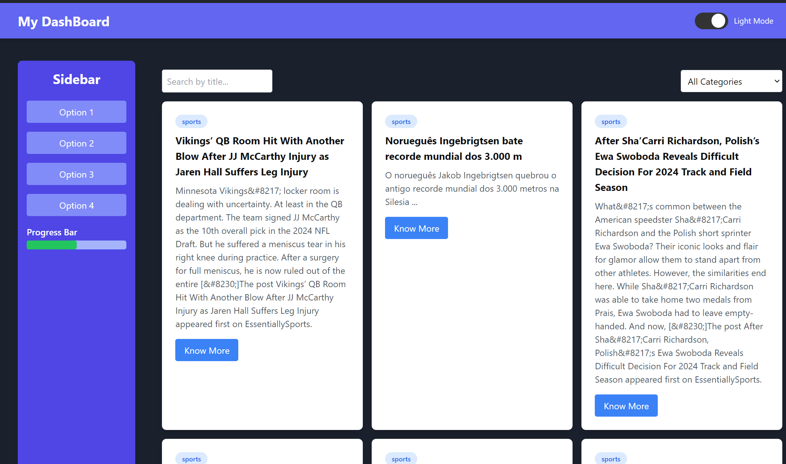

# My Dashboard

## Overview


My Dashboard is a modern web application built with Next.js, TypeScript, and Tailwind CSS. It provides a dynamic and responsive dashboard with a sidebar for category selection, a search bar for filtering content, and a feature grid for displaying news articles. The application fetches news data from the Mediastack API and allows users to filter and view news articles based on selected categories.

## Features

- **Dynamic Sidebar:** Allows users to select different categories to filter news articles.
- **Search Functionality:** Enables users to search for specific news articles based on keywords.
- **Feature Grid:** Displays news articles in a grid format, with support for filtering and searching.
- **Responsive Design:** Ensures the application is usable across various devices and screen sizes.
- **Progress Bar:** Displays a simple progress bar at the bottom of the sidebar.

## Setup Instructions

1. **Clone the Repository**
   ``` git clone https://github.com/your-username/my-dashboard.git  ```

2. **Navigate to the Project Directory**
   ``` cd my-dashboard ```

3. **Install dependencies**
    Ensure you have node.js installed, then run:

    ``` npm install ``` 

4. **Configure Environment Variables**
    Create a .env.local file in the root directory and add your Mediastack API key:

    ``` MEDIASTACK_API_KEY=your_api_key_here ```  

5. **Run the Development Server**
    Start the development server with:

    ``` npm run dev ```

## Approach and Assumptions

### Approach

- **Component-Based Architecture:** Utilized React components to modularize the application and ensure reusability. Key components include:
  - `Navbar`: Displays the main navigation.
  - `Sidebar`: Contains buttons for filtering news articles by category.
  - `SearchBar`: Allows users to search for news articles by keywords.
  - `CategoriesDropdown`: Provides a dropdown menu for category selection.
  - `FeatureCard`: Displays individual news articles.
  - `FeatureGrid`: Arranges `FeatureCard` components in a grid layout.

- **Client-Side State Management:** Used React's `useState` and `useEffect` hooks to manage the state of the selected category and search input. The `useEffect` hook is employed to fetch news articles from the API whenever the category or search term changes.

- **Responsive Design:** Applied Tailwind CSS for styling, ensuring that the layout adapts to various screen sizes and devices. This includes a flexible grid layout for displaying news articles and a responsive sidebar.

- **API Integration:** Integrated with the Mediastack API to fetch news articles. The `FeatureGrid` component retrieves and displays news based on the selected category. Error handling is included to manage API request failures.

### Assumptions

- **API Key Configuration:** It is assumed that the Mediastack API key is correctly configured in the `.env.local` file. The key must be valid for API requests to succeed.

- **Browser Compatibility:** The application is designed to work in modern browsers with JavaScript enabled. It is assumed that users have a basic understanding of navigating web applications.

- **Data Availability:** It is assumed that the Mediastack API provides data in the expected format and that the categories used for filtering are supported by the API.

- **User Interaction:** The application assumes users will interact with the sidebar buttons and search bar to filter and search for news articles. Proper UX/UI design is assumed to guide users effectively.

- **Performance:** It is assumed that the application handles a reasonable amount of data efficiently. For larger datasets, additional optimizations such as pagination or infinite scrolling may be necessary.


## Contact

Feel free to reach out to me through any of the following:

- **Email:** [your.email@example.com](mailto:neelmishra9125@gmail.com)
- **LinkedIn:** [Your LinkedIn Profile](https://www.linkedin.com/in/neelmishra07/)
- **Twitter:** [@your_twitter_handle](https://x.com/Neel_M7)
